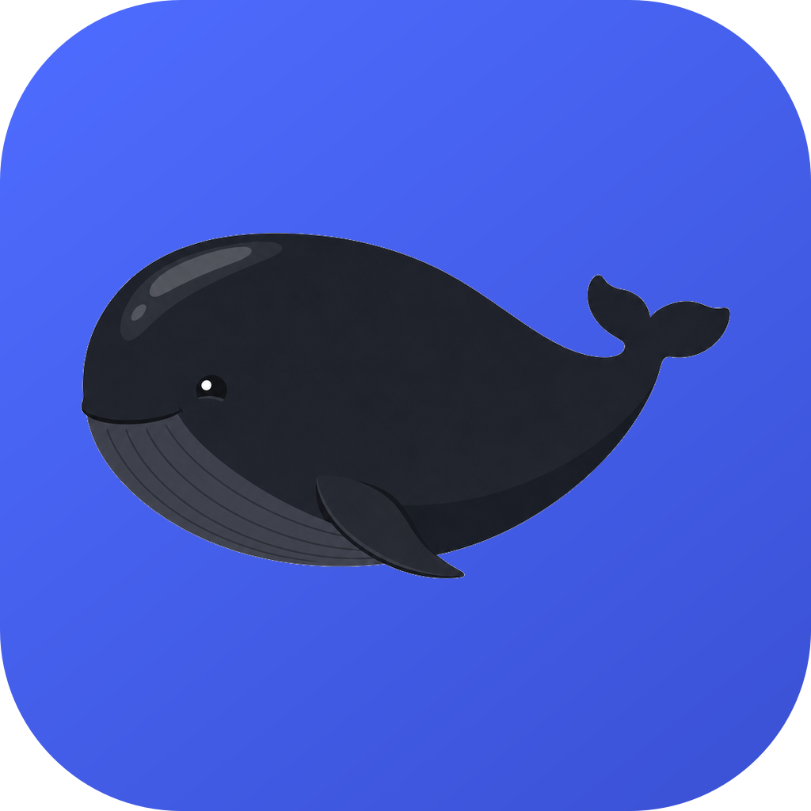

<div align="center">



# Krill

**[DeepSeek Harness](https://github.com/deepseek-ai/deepseek-harness) 的非官方 macOS 桌面端**

官方 Web 前端做主界面，外面套一层原生管理层

</div>

> [!IMPORTANT]
> **这不是 DeepSeek 官方项目**，与 DeepSeek 无隶属关系。官方只提供 `dsh web`（浏览器 + 常驻终端）。
> 本项目是个人自用的桌面外壳，自行承担使用风险。

---

## 这是什么

DeepSeek Harness（`dsh`）官方形态是 `dsh web` —— 起一个本地 HTTP 服务，用浏览器访问，
终端得一直挂着。Krill 把这只 Node 服务变成**隐藏的后台子进程**代为管理，双击即用。

但仅仅"不用挂终端"是不够的。Krill 在官方 Web 界面之外补了一层原生能力：

| 面板 | 干什么 |
|---|---|
| **会话** | 官方 dsh React SPA，零改动嵌入 |
| **插件** | 查询 / 安装 / 卸载 / 升级 / 启停 |
| **更新** | dsh CLI、已装插件、桌面 App 自身、源码仓库，四类更新检测 |
| **多模态** | 识图能力的本地（Ollama）与云端通道配置 |
| **桥接** | 本地 HTTP + stdio MCP shim，让 Claude Code 把 dsh 当第二意见来源 |
| **日志** | 应用日志与后端 stdout/stderr 实时合流 |

## 架构

```
┌─ 托盘 ────────────────────────────────────────────────┐
│ ● 后端运行中 :51823   ⬆ dsh rc.6 → rc.7               │
├───────────────────────────────────────────────────────┤
│ ┌────┬────────────────────────────────────────────┐   │
│ │ 会 │                                            │   │
│ │ 插 │   WebContentsView                          │   │
│ │ 更 │   http://127.0.0.1:<自动端口>               │   │
│ │ 多 │   官方 dsh React SPA（零改动）              │   │
│ │ 桥 │                                            │   │
│ │ 日 │                                            │   │
│ └────┴────────────────────────────────────────────┘   │
│   ↑ 外壳的 React 渲染层（BaseWindow 的底层 view）      │
└───────────────────────────────────────────────────────┘
      主进程：supervisor / update / plugins / vision / bridge
              │ spawn（隐藏）            │ HTTP :bridgePort
        dsh web（npm 内嵌）        外部调用方（Claude Code）
```

`BaseWindow` + 两个 `WebContentsView`：外壳在下层铺满整窗，官方 SPA 在上层按外壳上报的
矩形定位。**不用 iframe** —— WebContentsView 有独立渲染进程，SPA 崩了不会带走外壳，
导航拦截与缩放也能按 view 单独接线。

会话、凭据、模型配置仍然存放在 `~/.dsh`，与浏览器版**共用同一份数据**。
后端只绑 `127.0.0.1`，不暴露到网络。

## 开发

```bash
npm install
npm run embed     # 把 @deepseek-ai/dsh 装进 resources/dsh（约 312MB）
npm run icons     # 从 build/whale.png 生成 icns / 托盘图 / 品牌标
npm run dev       # 启动
```

前提：本机已初始化过 `~/.dsh/profiles/web`（即 `dsh web` 能正常跑起来）。

```bash
npm run typecheck  # 主进程 + 渲染层分别 tsc
npm run smoke      # 构建后启动，后端就绪即退出
npm run dist       # 打 dmg（尚未配置，见下）
```

开发期调试用的开关：

| 参数 | 作用 |
|---|---|
| `--smoke-test` | 后端就绪即退出，退出码表示成败 |
| `--capture=<前缀>` | 把两个 view 各抓一张 PNG 后退出。用 `capturePage` 而非系统截屏，**不需要屏幕录制权限**，无头环境也能出图 |

## 环境变量

| 变量 | 作用 |
|---|---|
| `DSH_BIN` | 指定 dsh 入口，优先级高于 userData 升级副本与内嵌资源 |
| `DSH_NODE` | 指定 node 解释器；缺省用 PATH 中的 node，再无则用 Electron 自带 Node |

## 安全边界

| 项 | 措施 |
|---|---|
| 后端绑定 | 仅 `127.0.0.1` |
| 渲染进程 | `contextIsolation: true`、`nodeIntegration: false`；官方 SPA 那层额外 `sandbox: true` |
| IPC | preload 按 [`src/shared/ipc.ts`](src/shared/ipc.ts) 白名单逐个暴露，**不透传裸 `ipcRenderer.invoke`** |
| 导航 | 外部链接一律 `shell.openExternal`，且只放行 http(s) |
| 子进程 | 退出时 SIGTERM → 5s 宽限 → SIGKILL，防孤儿端口 |
| 凭据 | 不内嵌任何密钥，沿用 `~/.dsh` 凭据系统 |
| 桥接接口 | **默认关闭**；启用后仅回环、强制 Bearer token、工作目录白名单 |

## 完成度

- [x] **P0** 工程脚手架（electron-vite + TypeScript strict + React）
- [x] **P1** 外壳骨架：后端 supervisor、双 view 窗口、托盘、日志面板
- [x] **P2** 更新中心：dsh CLI / 插件 / 源码仓库 / App 自身，四类检测
- [x] **P3** 插件管理器：清单合并、patch 体检、双通道安装、卸载四处清理、识别闭环
- [x] **P4** 桥接接口：两个端点（自描述文档 + 执行）+ stdio MCP shim
- [ ] **P5** 多模态控制台
- [ ] **P6** 打包分发（`npm run dist` 目前跑不了，缺 electron-builder 配置）

## 两个实现细节，供后来者避坑

**一、npm 的 `latest` dist-tag 在 dsh 家族上不可信。** `@deepseek-ai/dsh-base`、
`@deepseek-ai/dsh-web-app` 这些包的 `latest` 指向 `0.0.1-rc.1`，而实际最新是 `0.1.0-rc.7`。
（`@deepseek-ai/dsh` 本身的标签是对的，别被它误导。）任何版本检测都必须拉 `versions`
全量列表自己做 semver 排序 —— 用 `npm view <pkg> version` 会把升级报成降级。
见 [`src/shared/semver.ts`](src/shared/semver.ts) 与 [`tests/semver.check.ts`](tests/semver.check.ts)。

**二、源码仓库只报告，绝不自动 rebase。** 那个 checkout 里往往躺着未推上游的本地提交，
工作区还可能是脏的。旧版桌面端会后台静默 `git pull --rebase` —— 在实测环境里那意味着
把 4 个本地提交、带着未提交改动，rebase 到 111 个上游提交之上。Krill 只显示落后多少，
拉取是你自己点的按钮，冲突时中止并保留现场，**不代为解决**。

## 关于图标

那只黑色大肥鱼是 **[「蓝色大肥鱼」梗](https://www.gamersky.com/news/202608/2190273.shtml)的黑色版** ——
社区给 DeepSeek 鲸鱼吉祥物起的爱称。这是非官方外壳，所以不用官方那只蓝的。

制作过程：GPT Image 2 出概念稿 → 指定比例重绘（初版圆得像球，不像鲸）→
[`scripts/cutout.mjs`](scripts/cutout.mjs) 从画布边缘洪水填充抠图（不能用亮度阈值，
会把眼白和嘴线一起挖穿）→ [`scripts/gen-icons.mjs`](scripts/gen-icons.mjs) 合成全套。

## 许可

[MIT](LICENSE)

`dsh` 本身与其生态插件各自遵循各自的许可，与本项目无关。
